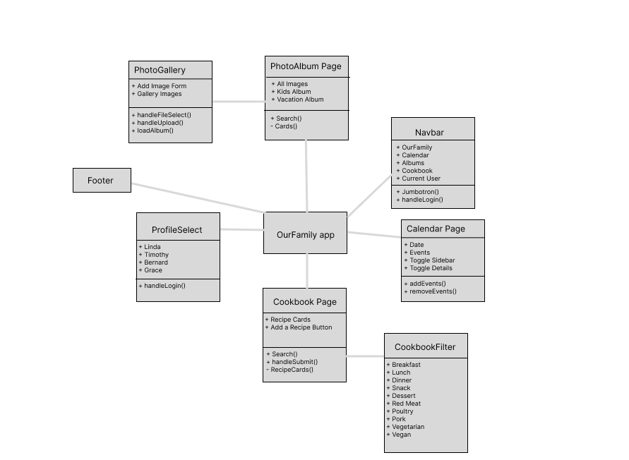
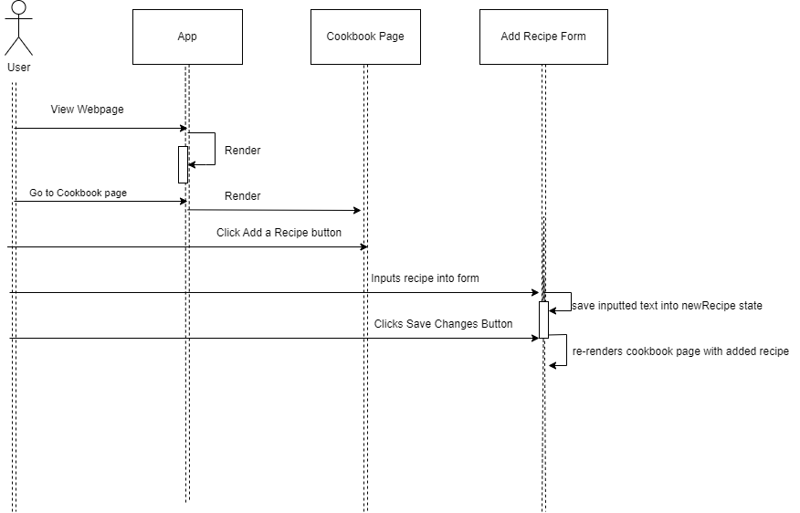
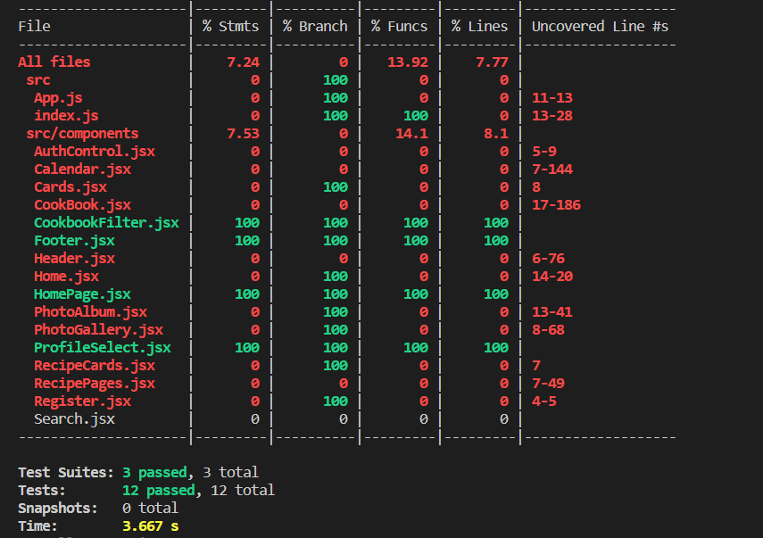

# INFO443 Project 1 Full Report: OurFamily Application

## Codebase description

This code base is for a website application called OurFamily, an app made to bring
families closer together with features including a virtual cookbook, a gallery of photo albums,
and an interactive calendar. This prototype was submitted as in INFO340 project in March 2023.
This software is formally a React application.

Checkout the hosted application here: https://family-app-7c595.web.app/

The original coders were Efra Ahsan, Kush Bhatia, Carl Searle, and Yusuf Farah.

The current repo editors are Efra Ahsan (eahsan@uw.edu) & Yuhang Liu (yliu34@uw.edu).

## Codebase Context

This application, OurFamily, is a prototype meant to be used by individuals of the same family to exist
as a communication and archival platform. The features include a shared calendar feature,
where family members can communicate their schedules and other events in one collective
area, as well as photo album and cookbook features that enable the family to store
chapters of their memories and family traditions in one shared spot.

## Mission of the Application

The mission of the application is to bring families closer together, both in terms of communication and over
shared nostalgia.

The goal of the application is to actively ease communication between members of a family in a fun and digitized way, because in the hecticness of family life it becomes difficult to remember all of the small
details of life events, especially while everyone wants to make their own plans. Therefore, easing communication in a virtual way could be convenient for any average family.

The other goal of OurFamily is to digitally archive some memories that often might get forgotten, such as photo albums of
specific times one might share with their family, and recipes that one might have created and/or grown up with. This
brings the family closer in a more long-term fashion because families can use OurFamily to grow their memory collections and
family bonds.

## Code Structure Analysis

### Architectural Elements
This project was built using React.js for front-end functionality, Firebase for back-end functionality, and an open-sourced React component that was imported as a library. We've abstracted an architectural analysis to consider each of the individual React components below. Additionally, Figure 1 illustrates each React component and their relationships.

#### Components in Project

##### OurFamily app
Renders all content in the project. The app instantiates all of the other components, but begins by directing users to the
ProfileSelect component on first render.

##### ProfileSelect
Commands user to select an avatar out of four options, and thereby directs them to the primary app content where the avatar
name will be reflected back to them.  

##### Navbar
Upon being directed to the app, the Navbar exists on every page and enables directing users to the different pages of the site, which is how users can access each of the features or switch avatar. The Navbar also contains a one-click Logout capability to release the avatar the user may have initially selected, thereby putting them in Guest mode.

##### Calendar Page
Renders and displays the interactive calendar upon which users can view, add, or delete events. Other interactivity includes
the ability to click on different days, months, and years.

##### Cookbook Page
Renders and displays any existing recipes on the account, and renders the CookbookFilter component. The page also enables searching for a recipe by name using a non-complex search bar, as well as a button to add a new recipe within a form upon an on-screen modal that can be submitted or cancelled out of.

##### CookbookFilter
Renders only on the Cookbook Page, this component allows the user to filter the Cookbook recipes being displayed using different checkboxes to guide their search.

##### PhotoAlbum Page
Renders and displays the existing photo albums on the account, and enables the user to search for an album by name using a non-complex search bar. The PhotoGallery component can only be accessed by clicking on a displayed album on this page.

##### PhotoGallery
Renders and displays the individual images in a formatted gallery for users to look through. Also contains a button that
enables users to add images from their local server unto this gallery.

##### Footer
Contains copyright information.

_Figure 1 - UML Component Diagram of OurFamily Website_

This figure illustrates how elements interact with each other in the project.

### 2. Code's Process Flow

Since the system is designed for a family, which means there might be multiple users to use the application, the first thing in the code process flow is to ask user to choose a user. When the user first open the website, the app will call the component ProfileSelect to render the 4 different usernames that a user could choose. And whenever a username is clicked, ProfileSelect will run `handleLogin()` function to set `currentProfile` value in App to be the name of the username and then navigate to Calendar page.

After navigating to Calendar page, the app will render a family calendar on the screen. Also the app will render a header with the value of `currentProfile`, which is the user's username and a footer. In the calendar component, a `handleSubmit()` function will be called when a user press the addEvent button. The calendar page uses a external library called 'revo-calendar' to generate the calendar. When user click a specific date on the calender, the calendar page will call a function `fetchEvents()` to get event information stored on that date. If there's no data stored, it will automatically render text "No events for this day".

Other than Calendar function, another flow is for Albums component. Whenever the nav item of Album is clicked, the page will be redirect to Album page with a hyperlink. Similarly, the page will redirect to Cookbook Page if the nav item of Cookbook is clicked.

_Figure 2 - UML Sequence Diagram of OurFamily Website_

A seuqence flow of a user trying to add a new recipe in Cookbook Page.

## Architecture Assessment

### Element Selection
The focus of our report will include the following aspects: the interaction with Footer, interaction with ProfileSelect component, and the functionality of Cookbook Filter.

### Architectural Deficiencies
Assessing the overall functionality and structure of these selected elements, there were several aspects that called for improvement. For report, we've assessed the Code Smells, Documentation/Readability Concerns, and Design Quality Deficiencies below.

#### Code Smells
The first code smell we detected was that of **duplicate code** in both the CookbookFilter component as well as the ProfileSelect component. We saw that instead of writing repeated chunks of code into reusable function with paramaters, the code was duplicated to produce the desired outcome, even in situations where the only difference between chunks was a single word.

_Refactoring:_ In Cookbook Filter, these are couple of duplicated lines for creating the checkbox in the filter with. In previous code, we manually create 10 Forms for the checkboxs. In our refactoring, we create a new function `createForm(name,type)` that could create a form with the parameter "name" and "type". By doing so, we don't need to write a long line of a form element when we want to add a new checkbox, instead, we could just call `createForm()` with the name we want and the type to create a checkbox.

Also, in HomePage, there is a duplicated rendering

The second code smell we detected was that there were **zero comments**. This is concerning because specifically for one of our elements of concern, the ProfileSelect component, a comment explaining one of the state functionalities that was passed
parent to child would have been really helpful because the process of switching users is not the most intuitive. It's especially worth commenting what the initial state value is because that information is difficult to find for anyone who did not write the original version of code. Additionally, within the CookbookFilter component, comments would have been helpful to indicate what the nature of the click handler function is, since it's passed in as a prop.

_Refactoring:_ We add some comments 

A third code smell was that of **speculative generality** within the CookbookFilter component, because the function
is tracking units such as the "id" and "name" of each of the checkboxes despite this information never being used. The
function already tracks the "label" property of each of the checkboxes, which is how other coupled functions are able
to use the information to filter the cookbook to the users' selections, so the "id" and "name" properties can be discarded.

_Refactoring:_ We removed the unused value and unused library in ProfileSelect, Footer and CookbookFilter. With linter, the unused value is marked with underline and we just removed the unused "id" property of in our cookbook filter.

A fourth code smell is that the ProfileSelect component includes a commented-out button to "Edit Profile", which is a **non-existing affordance of the software**. It's important to remove code like this entirely because it doesn't fit the affordances
of the application and is simply confusing to leave documented within the program.

_Refactoring:_ 

A fifth code smell we generally saw across the code was that of **long functions**. Although this goes in hand with the first smell of *duplicate code* being written across the software, the issue with long functions definitely needs to be resolved
because the software loses its articulation and readability when it's long and unorganized.

_Refactoring:_ 
#### Documentation/Readability Concerns

#### Design Quality Deficiencies

## Unit/Integration Tests
### Testing Overview

### Testing Breakdown

## Testing Instruction
- First, run the following command:
`npm install --save-dev jest --force`

- Next, run `Npm test` followed by typing `a` into the terminal and hitting enter to run all of the tests.

If you'd like to run each test file individually, hit ^C to exit out of the Watch Usage interface back onto the regular terminal, and
run `Npm test footer` to see Footer.test.js *or* `Npm test profile` to see ProfileSelect.test.js *or* `Npm test cookbook` to see CookbookFilter.test.js.

- You can also run `npm run test:coverage` to see the generated coverage report, as shown below.

## Automated test coverage

_Figure 3 - The three main functionalities we tested in our automated test is the interaction with Footer, interaction with ProfileSelect component and the functionality of Cookbook Filter. These three components got 100% coverage._
